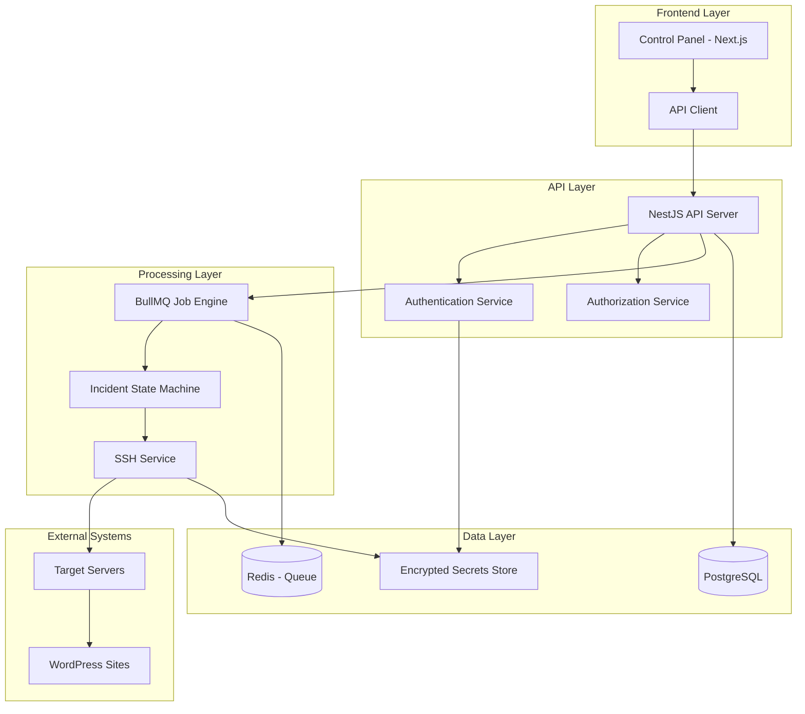

# Design Document: WP-AutoHealer

## Overview

WP-AutoHealer is a production-grade WordPress self-healing system that functions as an autonomous Level-1.5 SRE/Support Engineer. The system automatically diagnoses and remediates WordPress website errors on Linux servers via SSH, using conservative minimal reversible changes while preserving all existing business, SEO, content, and behavioral characteristics.

The architecture follows a microservices pattern with clear separation of concerns:
- **Backend API**: NestJS-based REST API with comprehensive RBAC
- **Job Engine**: BullMQ-powered state machine for incident processing
- **Frontend**: Next.js control panel with real-time updates
- **Database**: PostgreSQL with Prisma ORM for data persistence
- **Security**: End-to-end encryption with libsodium and strict SSH verification

## Architecture

### High-Level Architecture



### Component Architecture

The system is organized into distinct modules following NestJS conventions:

- **Auth Module**: Handles authentication, MFA, and session management
- **Users Module**: User and role management with RBAC
- **Servers Module**: Server connection and credential management
- **Sites Module**: WordPress site configuration and monitoring
- **Incidents Module**: Incident lifecycle and timeline management
- **Jobs Module**: Background job processing and state management
- **SSH Module**: Secure shell operations and command execution
- **Evidence Module**: Log collection and diagnostic data storage
- **Backup Module**: Rollback artifact creation and management
- **Verification Module**: Site health checking and validation
- **Audit Module**: Comprehensive audit logging and compliance

## Components and Interfaces

### Core Services

#### SSH Service
```typescript
interface SSHService {
  connect(serverId: string): Promise<SSHConnection>
  executeCommand(connection: SSHConnection, command: string): Promise<CommandResult>
  uploadFile(connection: SSHConnection, localPath: string, remotePath: string): Promise<void>
  downloadFile(connection: SSHConnection, remotePath: string, localPath: string): Promise<void>
  disconnect(connection: SSHConnection): Promise<void>
}

interface CommandResult {
  stdout: string
  stderr: string
  exitCode: number
  executionTime: number
  timestamp: Date
}
```

#### Job Engine Service
```typescript
interface JobEngineService {
  createIncident(siteId: string, triggerType: TriggerType): Promise<string>
  processIncident(incidentId: string): Promise<void>
  getIncidentStatus(incidentId: string): Promise<IncidentStatus>
  pauseIncident(incidentId: string): Promise<void>
  resumeIncident(incidentId: string): Promise<void>
  escalateIncident(incidentId: string, reason: string): Promise<void>
}

enum IncidentState {
  NEW = 'NEW',
  DISCOVERY = 'DISCOVERY',
  BASELINE = 'BASELINE',
  BACKUP = 'BACKUP',
  OBSERVABILITY = 'OBSERVABILITY',
  FIX_ATTEMPT = 'FIX_ATTEMPT',
  VERIFY = 'VERIFY',
  FIXED = 'FIXED',
  ROLLBACK = 'ROLLBACK',
  ESCALATED = 'ESCALATED'
}
```

#### Discovery Service
```typescript
interface DiscoveryService {
  detectOperatingSystem(connection: SSHConnection): Promise<OSInfo>
  detectWebServer(connection: SSHConnection): Promise<WebServerInfo>
  detectControlPanel(connection: SSHConnection): Promise<ControlPanelInfo>
  detectPHPHandler(connection: SSHConnection): Promise<PHPInfo>
  detectWordPressInstallation(connection: SSHConnection, domain: string): Promise<WordPressInfo>
  detectDatabaseEngine(connection: SSHConnection): Promise<DatabaseInfo>
  detectCachingSystems(connection: SSHConnection): Promise<CacheInfo[]>
}
```

#### Verification Service
```typescript
interface VerificationService {
  performHealthCheck(site: Site): Promise<HealthCheckResult>
  verifyWordPressCore(site: Site): Promise<CoreVerificationResult>
  verifyLoginFunctionality(site: Site): Promise<LoginVerificationResult>
  verifyInternalUrls(site: Site): Promise<UrlVerificationResult[]>
  detectFatalErrors(response: string): boolean
  detectMaintenanceMode(response: string): boolean
  detectWhiteScreen(response: string): boolean
}
```

### Data Models

#### Core Entities

```typescript
interface User {
  id: string
  email: string
  passwordHash: string
  role: UserRole
  mfaEnabled: boolean
  mfaSecret?: string
  createdAt: Date
  updatedAt: Date
  lastLoginAt?: Date
}

interface Server {
  id: string
  name: string
  hostname: string
  port: number
  username: string
  authType: 'key' | 'password'
  encryptedCredentials: string
  hostKeyFingerprint: string
  controlPanel?: ControlPanelType
  osInfo?: OSInfo
  createdAt: Date
  updatedAt: Date
}

interface Site {
  id: string
  serverId: string
  domain: string
  documentRoot: string
  wordpressPath: string
  isMultisite: boolean
  siteUrl: string
  adminUrl: string
  isActive: boolean
  lastHealthCheck?: Date
  createdAt: Date
  updatedAt: Date
}

interface Incident {
  id: string
  siteId: string
  state: IncidentState
  triggerType: TriggerType
  priority: Priority
  fixAttempts: number
  maxFixAttempts: number
  createdAt: Date
  updatedAt: Date
  resolvedAt?: Date
  escalatedAt?: Date
  escalationReason?: string
}

interface IncidentEvent {
  id: string
  incidentId: string
  eventType: EventType
  phase: IncidentState
  step: string
  data: Record<string, any>
  timestamp: Date
  duration?: number
}

interface CommandExecution {
  id: string
  incidentId: string
  command: string
  stdout: string
  stderr: string
  exitCode: number
  executionTime: number
  timestamp: Date
  serverId: string
}

interface Evidence {
  id: string
  incidentId: string
  evidenceType: EvidenceType
  signature: string
  content: string
  metadata: Record<string, any>
  timestamp: Date
}

interface BackupArtifact {
  id: string
  incidentId: string
  artifactType: ArtifactType
  filePath: string
  originalPath: string
  checksum: string
  size: number
  metadata: Record<string, any>
  createdAt: Date
}

interface FileChange {
  id: string
  incidentId: string
  filePath: string
  changeType: ChangeType
  originalContent?: string
  newContent?: string
  diff: string
  checksum: string
  timestamp: Date
}
```

## Data Models

### Database Schema Design

The PostgreSQL database uses the following schema structure:

```sql
-- Users and Authentication
CREATE TABLE users (
  id UUID PRIMARY KEY DEFAULT gen_random_uuid(),
  email VARCHAR(255) UNIQUE NOT NULL,
  password_hash VARCHAR(255) NOT NULL,
  role VARCHAR(50) NOT NULL,
  mfa_enabled BOOLEAN DEFAULT FALSE,
  mfa_secret TEXT,
  created_at TIMESTAMP DEFAULT NOW(),
  updated_at TIMESTAMP DEFAULT NOW(),
  last_login_at TIMESTAMP
);

CREATE TABLE user_sessions (
  id UUID PRIMARY KEY DEFAULT gen_random_uuid(),
  user_id UUID REFERENCES users(id) ON DELETE CASCADE,
  session_token VARCHAR(255) UNIQUE NOT NULL,
  expires_at TIMESTAMP NOT NULL,
  created_at TIMESTAMP DEFAULT NOW()
);

-- Server Management
CREATE TABLE servers (
  id UUID PRIMARY KEY DEFAULT gen_random_uuid(),
  name VARCHAR(255) NOT NULL,
  hostname VARCHAR(255) NOT NULL,
  port INTEGER DEFAULT 22,
  username VARCHAR(255) NOT NULL,
  auth_type VARCHAR(20) NOT NULL CHECK (auth_type IN ('key', 'password')),
  encrypted_credentials TEXT NOT NULL,
  host_key_fingerprint VARCHAR(255),
  control_panel VARCHAR(50),
  os_info JSONB,
  created_at TIMESTAMP DEFAULT NOW(),
  updated_at TIMESTAMP DEFAULT NOW()
);

-- Site Management
CREATE TABLE sites (
  id UUID PRIMARY KEY DEFAULT gen_random_uuid(),
  server_id UUID REFERENCES servers(id) ON DELETE CASCADE,
  domain VARCHAR(255) NOT NULL,
  document_root VARCHAR(500) NOT NULL,
  wordpress_path VARCHAR(500) NOT NULL,
  is_multisite BOOLEAN DEFAULT FALSE,
  site_url VARCHAR(500) NOT NULL,
  admin_url VARCHAR(500) NOT NULL,
  is_active BOOLEAN DEFAULT TRUE,
  last_health_check TIMESTAMP,
  created_at TIMESTAMP DEFAULT NOW(),
  updated_at TIMESTAMP DEFAULT NOW()
);

-- Incident Management
CREATE TABLE incidents (
  id UUID PRIMARY KEY DEFAULT gen_random_uuid(),
  site_id UUID REFERENCES sites(id) ON DELETE CASCADE,
  state VARCHAR(50) NOT NULL,
  trigger_type VARCHAR(50) NOT NULL,
  priority VARCHAR(20) NOT NULL,
  fix_attempts INTEGER DEFAULT 0,
  max_fix_attempts INTEGER DEFAULT 15,
  created_at TIMESTAMP DEFAULT NOW(),
  updated_at TIMESTAMP DEFAULT NOW(),
  resolved_at TIMESTAMP,
  escalated_at TIMESTAMP,
  escalation_reason TEXT
);

-- Incident Timeline (Append-Only)
CREATE TABLE incident_events (
  id UUID PRIMARY KEY DEFAULT gen_random_uuid(),
  incident_id UUID REFERENCES incidents(id) ON DELETE CASCADE,
  event_type VARCHAR(100) NOT NULL,
  phase VARCHAR(50) NOT NULL,
  step VARCHAR(200) NOT NULL,
  data JSONB,
  timestamp TIMESTAMP DEFAULT NOW(),
  duration INTEGER -- milliseconds
);

-- Command Execution Logs
CREATE TABLE command_executions (
  id UUID PRIMARY KEY DEFAULT gen_random_uuid(),
  incident_id UUID REFERENCES incidents(id) ON DELETE CASCADE,
  command TEXT NOT NULL,
  stdout TEXT,
  stderr TEXT,
  exit_code INTEGER,
  execution_time INTEGER, -- milliseconds
  timestamp TIMESTAMP DEFAULT NOW(),
  server_id UUID REFERENCES servers(id)
);

-- Evidence Collection
CREATE TABLE evidence (
  id UUID PRIMARY KEY DEFAULT gen_random_uuid(),
  incident_id UUID REFERENCES incidents(id) ON DELETE CASCADE,
  evidence_type VARCHAR(100) NOT NULL,
  signature VARCHAR(255) NOT NULL,
  content TEXT NOT NULL,
  metadata JSONB,
  timestamp TIMESTAMP DEFAULT NOW()
);

-- Backup Artifacts
CREATE TABLE backup_artifacts (
  id UUID PRIMARY KEY DEFAULT gen_random_uuid(),
  incident_id UUID REFERENCES incidents(id) ON DELETE CASCADE,
  artifact_type VARCHAR(100) NOT NULL,
  file_path VARCHAR(500) NOT NULL,
  original_path VARCHAR(500) NOT NULL,
  checksum VARCHAR(255) NOT NULL,
  size BIGINT NOT NULL,
  metadata JSONB,
  created_at TIMESTAMP DEFAULT NOW()
);

-- File Changes and Diffs
CREATE TABLE file_changes (
  id UUID PRIMARY KEY DEFAULT gen_random_uuid(),
  incident_id UUID REFERENCES incidents(id) ON DELETE CASCADE,
  file_path VARCHAR(500) NOT NULL,
  change_type VARCHAR(50) NOT NULL,
  original_content TEXT,
  new_content TEXT,
  diff TEXT NOT NULL,
  checksum VARCHAR(255) NOT NULL,
  timestamp TIMESTAMP DEFAULT NOW()
);

-- Verification Results
CREATE TABLE verification_results (
  id UUID PRIMARY KEY DEFAULT gen_random_uuid(),
  incident_id UUID REFERENCES incidents(id) ON DELETE CASCADE,
  verification_type VARCHAR(100) NOT NULL,
  status VARCHAR(50) NOT NULL,
  details JSONB,
  timestamp TIMESTAMP DEFAULT NOW()
);

-- Audit Trail
CREATE TABLE audit_events (
  id UUID PRIMARY KEY DEFAULT gen_random_uuid(),
  user_id UUID REFERENCES users(id),
  action VARCHAR(200) NOT NULL,
  resource_type VARCHAR(100) NOT NULL,
  resource_id VARCHAR(255),
  details JSONB,
  ip_address INET,
  user_agent TEXT,
  timestamp TIMESTAMP DEFAULT NOW()
);

-- Retention Policy Configuration
CREATE TABLE retention_policies (
  id UUID PRIMARY KEY DEFAULT gen_random_uuid(),
  policy_name VARCHAR(100) UNIQUE NOT NULL,
  retention_days INTEGER NOT NULL CHECK (retention_days >= 1 AND retention_days <= 7),
  applies_to VARCHAR(100) NOT NULL,
  is_active BOOLEAN DEFAULT TRUE,
  created_at TIMESTAMP DEFAULT NOW(),
  updated_at TIMESTAMP DEFAULT NOW()
);

-- Purge Audit Trail
CREATE TABLE purge_audit (
  id UUID PRIMARY KEY DEFAULT gen_random_uuid(),
  policy_id UUID REFERENCES retention_policies(id),
  table_name VARCHAR(100) NOT NULL,
  records_purged INTEGER NOT NULL,
  cutoff_date TIMESTAMP NOT NULL,
  executed_at TIMESTAMP DEFAULT NOW(),
  executed_by UUID REFERENCES users(id)
);
```

### Indexes for Performance

```sql
-- Performance indexes
CREATE INDEX idx_incidents_site_id ON incidents(site_id);
CREATE INDEX idx_incidents_state ON incidents(state);
CREATE INDEX idx_incidents_created_at ON incidents(created_at);
CREATE INDEX idx_incident_events_incident_id ON incident_events(incident_id);
CREATE INDEX idx_incident_events_timestamp ON incident_events(timestamp);
CREATE INDEX idx_command_executions_incident_id ON command_executions(incident_id);
CREATE INDEX idx_evidence_incident_id ON evidence(incident_id);
CREATE INDEX idx_backup_artifacts_incident_id ON backup_artifacts(incident_id);
CREATE INDEX idx_file_changes_incident_id ON file_changes(incident_id);
CREATE INDEX idx_audit_events_timestamp ON audit_events(timestamp);
CREATE INDEX idx_audit_events_user_id ON audit_events(user_id);

-- Retention policy indexes
CREATE INDEX idx_incidents_created_at_retention ON incidents(created_at) WHERE resolved_at IS NOT NULL;
CREATE INDEX idx_incident_events_timestamp_retention ON incident_events(timestamp);
CREATE INDEX idx_command_executions_timestamp_retention ON command_executions(timestamp);
```

Now I need to use the prework tool to analyze the acceptance criteria before writing the Correctness Properties section.

<function_calls>
<invoke name="prework">
<parameter name="featureName">wp-autohealer

## Correctness Properties

*A property is a characteristic or behavior that should hold true across all valid executions of a system—essentially, a formal statement about what the system should do. Properties serve as the bridge between human-readable specifications and machine-verifiable correctness guarantees.*

Based on the prework analysis, the following properties have been identified for comprehensive testing:

### Property 1: Complete Incident Data Storage
*For any* incident that occurs in the system, all required operation data (phases, steps, commands, stdout/stderr, log signatures, verification results, file diffs, backup metadata, and rollback plans) should be stored in the database.
**Validates: Requirements 2.1**

### Property 2: Unique Operation Identifiers
*For any* operation performed by the system, a unique trace ID and correlation ID should be assigned and recorded.
**Validates: Requirements 2.4**

### Property 3: Complete Operation Audit Trail
*For any* operation performed by the system, timestamps and actor identity should be recorded in the audit trail.
**Validates: Requirements 2.5**

### Property 4: Retention Policy Hard Cap Enforcement
*For any* retention configuration attempt, values outside the 1-7 day range should be rejected and the hard cap should be enforced.
**Validates: Requirements 3.2**

### Property 5: Automatic Data Purging
*For any* data that exceeds the configured retention period, the system should automatically purge it according to the retention policy.
**Validates: Requirements 3.3**

### Property 6: Purge Operation Audit Trail
*For any* purge operation performed by the system, an audit record should be created with details of what was purged.
**Validates: Requirements 3.4**

### Property 7: Server Environment Auto-Detection
*For any* server connection, the system should successfully auto-detect operating system, web server type, control panel software, PHP handler, document root paths, WordPress paths, database engine, caching systems, and multisite configuration.
**Validates: Requirements 4.1, 4.2, 4.3, 4.4, 4.5, 4.6, 4.7, 4.8, 4.9**

### Property 8: Rollback Artifact Prerequisite
*For any* production file modification, rollback artifacts should exist and be recorded in the database before the modification occurs.
**Validates: Requirements 5.1, 5.6**

### Property 9: Fix Attempt Limit Enforcement
*For any* incident, the system should enforce the maximum of 15 applied-change attempts and prevent further attempts once the limit is reached.
**Validates: Requirements 5.2**

### Property 10: Hypothesis-Driven Fix Process
*For any* fix attempt, the system should follow the prescribed process: hypothesis → evidence → minimal change → verify → record.
**Validates: Requirements 5.3**

### Property 11: Behavioral Change Detection and Rollback
*For any* fix that changes output, layout, URLs, metadata, or SEO behavior, the system should detect the change, treat it as a failure, and initiate rollback.
**Validates: Requirements 5.5**

### Property 12: Secret Redaction in Logs and APIs
*For any* log entry or API response, secrets should never be displayed in plain text and should be consistently redacted.
**Validates: Requirements 6.1, 6.10**

### Property 13: Secret Encryption at Rest
*For any* secret stored in the system, it should be encrypted using libsodium before being persisted to storage.
**Validates: Requirements 6.2**

### Property 14: SSH Strict Host Key Checking
*For any* SSH connection attempt, strict host key checking should be enforced to prevent man-in-the-middle attacks.
**Validates: Requirements 6.4**

### Property 15: Input Validation Security
*For any* input provided to the system, validation should prevent SSRF and injection attacks by rejecting malicious payloads.
**Validates: Requirements 6.5**

### Property 16: Safe SSH Command Templating
*For any* SSH command execution, safe templating should be used to prevent command injection vulnerabilities.
**Validates: Requirements 6.6**

### Property 17: Least-Privilege Command Execution
*For any* command executed by the system, it should run with the minimum privileges necessary to complete the operation.
**Validates: Requirements 6.7**

### Property 18: API Rate Limiting
*For any* API endpoint, rate limiting should be enforced to prevent abuse and ensure fair resource usage.
**Validates: Requirements 6.8**

### Property 19: Security Event Audit Logging
*For any* security-relevant event, an audit log entry should be created with complete details.
**Validates: Requirements 6.9**

### Property 20: Job Engine State Machine Compliance
*For any* incident processed by the job engine, state transitions should follow the defined state machine: NEW → DISCOVERY → BASELINE → BACKUP → OBSERVABILITY → FIX_ATTEMPT(n) → VERIFY → FIXED/ROLLBACK/ESCALATED.
**Validates: Requirements 8.1**

### Property 21: Job Idempotency and Resumability
*For any* job that is interrupted by a system crash, it should be resumable and produce the same result when restarted.
**Validates: Requirements 8.2**

### Property 22: Flapping Prevention with Cooldowns
*For any* rapid succession of job creation attempts, cooldown windows should prevent flapping behavior.
**Validates: Requirements 8.3**

### Property 23: Circuit Breaker Activation
*For any* operation that fails repeatedly, circuit breakers should activate to prevent continued failure attempts.
**Validates: Requirements 8.4**

### Property 24: Bounded Loop Prevention
*For any* processing loop in the system, bounds should be enforced to prevent infinite processing.
**Validates: Requirements 8.5**

### Property 25: State Transition Tracking
*For any* state transition in the job engine, timestamps and reasons should be recorded for audit purposes.
**Validates: Requirements 8.6**

### Property 26: Fix Tier Priority Enforcement
*For any* incident with multiple applicable fixes, the system should execute fixes in tier priority order (Tier 1 through Tier 6).
**Validates: Requirements 12.7**

### Property 27: Fix Attempt Documentation
*For any* fix attempt made by the system, the rationale and reasoning should be documented and stored.
**Validates: Requirements 12.8**

### Property 28: Comprehensive Response Verification
*For any* site verification, the system should check beyond HTTP 200 status codes and detect fatal errors, maintenance mode, and white-screen conditions.
**Validates: Requirements 13.1, 13.2**

### Property 29: Required HTML Element Verification
*For any* site response, the system should verify the presence of title tags, canonical tags, and footer/header markers.
**Validates: Requirements 13.3, 13.4, 13.5**

### Property 30: WordPress Functionality Testing
*For any* WordPress site verification, wp-login functionality and internal URL accessibility should be tested.
**Validates: Requirements 13.6, 13.7**

### Property 31: Verification Result Storage
*For any* verification operation performed, all results should be recorded in the database for audit and analysis.
**Validates: Requirements 13.8**

### Property 32: Verification Failure on Missing Markers
*For any* site response that lacks expected markers (title, canonical, footer/header), verification should fail and be recorded as such.
**Validates: Requirements 13.9**

## Error Handling

### Error Classification

The system implements a comprehensive error handling strategy with the following classifications:

1. **Recoverable Errors**: Temporary issues that can be retried (network timeouts, temporary file locks)
2. **Non-Recoverable Errors**: Permanent failures requiring escalation (authentication failures, missing files)
3. **Security Errors**: Security-related issues requiring immediate attention (injection attempts, unauthorized access)
4. **System Errors**: Infrastructure failures requiring system administrator intervention

### Error Handling Patterns

#### SSH Connection Errors
```typescript
class SSHConnectionError extends Error {
  constructor(
    message: string,
    public readonly hostname: string,
    public readonly port: number,
    public readonly cause?: Error
  ) {
    super(message);
  }
}

// Retry logic with exponential backoff
async function connectWithRetry(config: SSHConfig, maxRetries = 3): Promise<SSHConnection> {
  for (let attempt = 1; attempt <= maxRetries; attempt++) {
    try {
      return await ssh.connect(config);
    } catch (error) {
      if (attempt === maxRetries || !isRetryableError(error)) {
        throw new SSHConnectionError(`Failed to connect after ${maxRetries} attempts`, config.hostname, config.port, error);
      }
      await delay(Math.pow(2, attempt) * 1000); // Exponential backoff
    }
  }
}
```

#### Job Processing Errors
```typescript
class JobProcessingError extends Error {
  constructor(
    message: string,
    public readonly jobId: string,
    public readonly phase: IncidentState,
    public readonly retryable: boolean = false
  ) {
    super(message);
  }
}

// Circuit breaker pattern for failing jobs
class CircuitBreaker {
  private failures = 0;
  private lastFailureTime?: Date;
  private state: 'CLOSED' | 'OPEN' | 'HALF_OPEN' = 'CLOSED';

  async execute<T>(operation: () => Promise<T>): Promise<T> {
    if (this.state === 'OPEN') {
      if (this.shouldAttemptReset()) {
        this.state = 'HALF_OPEN';
      } else {
        throw new Error('Circuit breaker is OPEN');
      }
    }

    try {
      const result = await operation();
      this.onSuccess();
      return result;
    } catch (error) {
      this.onFailure();
      throw error;
    }
  }
}
```

#### Validation Errors
```typescript
class ValidationError extends Error {
  constructor(
    message: string,
    public readonly field: string,
    public readonly value: any,
    public readonly constraint: string
  ) {
    super(message);
  }
}

// Input sanitization and validation
function validateAndSanitizeInput(input: string, type: 'command' | 'path' | 'domain'): string {
  switch (type) {
    case 'command':
      if (containsInjectionPatterns(input)) {
        throw new ValidationError('Command contains potentially dangerous patterns', 'command', input, 'no_injection');
      }
      return sanitizeCommand(input);
    case 'path':
      if (!isValidPath(input)) {
        throw new ValidationError('Invalid file path format', 'path', input, 'valid_path');
      }
      return normalizePath(input);
    case 'domain':
      if (!isValidDomain(input)) {
        throw new ValidationError('Invalid domain format', 'domain', input, 'valid_domain');
      }
      return input.toLowerCase();
  }
}
```

### Global Error Handler

```typescript
@Catch()
export class GlobalExceptionFilter implements ExceptionFilter {
  private readonly logger = new Logger(GlobalExceptionFilter.name);

  catch(exception: unknown, host: ArgumentsHost) {
    const ctx = host.switchToHttp();
    const response = ctx.getResponse<Response>();
    const request = ctx.getRequest<Request>();

    let status = HttpStatus.INTERNAL_SERVER_ERROR;
    let message = 'Internal server error';
    let code = 'INTERNAL_ERROR';

    if (exception instanceof HttpException) {
      status = exception.getStatus();
      message = exception.message;
      code = this.getErrorCode(exception);
    } else if (exception instanceof ValidationError) {
      status = HttpStatus.BAD_REQUEST;
      message = exception.message;
      code = 'VALIDATION_ERROR';
    } else if (exception instanceof SSHConnectionError) {
      status = HttpStatus.SERVICE_UNAVAILABLE;
      message = 'Unable to connect to server';
      code = 'SSH_CONNECTION_ERROR';
    }

    // Log error with context
    this.logger.error({
      message: exception instanceof Error ? exception.message : 'Unknown error',
      stack: exception instanceof Error ? exception.stack : undefined,
      url: request.url,
      method: request.method,
      userAgent: request.get('user-agent'),
      ip: request.ip,
      timestamp: new Date().toISOString(),
    });

    // Redact sensitive information from response
    const sanitizedMessage = this.redactSensitiveInfo(message);

    response.status(status).json({
      statusCode: status,
      message: sanitizedMessage,
      code,
      timestamp: new Date().toISOString(),
      path: request.url,
    });
  }

  private redactSensitiveInfo(message: string): string {
    // Redact common sensitive patterns
    return message
      .replace(/password[=:]\s*\S+/gi, 'password=***')
      .replace(/key[=:]\s*\S+/gi, 'key=***')
      .replace(/token[=:]\s*\S+/gi, 'token=***')
      .replace(/secret[=:]\s*\S+/gi, 'secret=***');
  }
}
```

## Testing Strategy

### Dual Testing Approach

The WP-AutoHealer system employs a comprehensive dual testing strategy combining unit tests and property-based tests to ensure correctness and reliability:

**Unit Tests**: Focus on specific examples, edge cases, and error conditions
- Test specific scenarios with known inputs and expected outputs
- Verify integration points between components
- Test error handling and edge cases
- Validate specific business logic implementations

**Property-Based Tests**: Verify universal properties across all inputs
- Test properties that should hold for any valid input
- Use randomized input generation to discover edge cases
- Verify system invariants and correctness properties
- Ensure comprehensive input coverage through automation

### Property-Based Testing Configuration

The system uses **fast-check** library for TypeScript property-based testing with the following configuration:

- **Minimum 100 iterations** per property test to ensure adequate coverage
- Each property test references its corresponding design document property
- Tag format: **Feature: wp-autohealer, Property {number}: {property_text}**
- Custom generators for domain-specific data types (SSH configs, WordPress sites, etc.)

### Testing Framework Setup

```typescript
// Property-based testing setup
import fc from 'fast-check';

describe('WP-AutoHealer Property Tests', () => {
  // Feature: wp-autohealer, Property 1: Complete Incident Data Storage
  it('should store all required incident data for any incident', () => {
    fc.assert(
      fc.property(
        incidentGenerator(),
        async (incident) => {
          const storedData = await incidentService.createIncident(incident);
          
          expect(storedData).toHaveProperty('phases');
          expect(storedData).toHaveProperty('steps');
          expect(storedData).toHaveProperty('commands');
          expect(storedData).toHaveProperty('stdout');
          expect(storedData).toHaveProperty('stderr');
          expect(storedData).toHaveProperty('logSignatures');
          expect(storedData).toHaveProperty('verificationResults');
          expect(storedData).toHaveProperty('fileDiffs');
          expect(storedData).toHaveProperty('backupMetadata');
          expect(storedData).toHaveProperty('rollbackPlans');
        }
      ),
      { numRuns: 100 }
    );
  });

  // Feature: wp-autohealer, Property 12: Secret Redaction in Logs and APIs
  it('should redact secrets from all logs and API responses', () => {
    fc.assert(
      fc.property(
        fc.record({
          password: fc.string(),
          apiKey: fc.string(),
          token: fc.string(),
          logMessage: fc.string()
        }),
        (data) => {
          const logEntry = logger.createLogEntry(data.logMessage, data);
          const apiResponse = apiService.createResponse(data);
          
          expect(logEntry).not.toContain(data.password);
          expect(logEntry).not.toContain(data.apiKey);
          expect(logEntry).not.toContain(data.token);
          
          expect(JSON.stringify(apiResponse)).not.toContain(data.password);
          expect(JSON.stringify(apiResponse)).not.toContain(data.apiKey);
          expect(JSON.stringify(apiResponse)).not.toContain(data.token);
        }
      ),
      { numRuns: 100 }
    );
  });
});

// Custom generators for domain-specific types
const incidentGenerator = () => fc.record({
  siteId: fc.uuid(),
  triggerType: fc.constantFrom('manual', 'monitoring', 'webhook'),
  priority: fc.constantFrom('low', 'medium', 'high', 'critical'),
  metadata: fc.dictionary(fc.string(), fc.anything())
});

const sshConfigGenerator = () => fc.record({
  hostname: fc.domain(),
  port: fc.integer({ min: 1, max: 65535 }),
  username: fc.string({ minLength: 1, maxLength: 32 }),
  authType: fc.constantFrom('key', 'password'),
  strictHostKeyChecking: fc.constant(true)
});
```

### Unit Testing Strategy

Unit tests complement property-based tests by focusing on:

1. **Specific Business Logic**: Test exact scenarios with known outcomes
2. **Integration Points**: Verify component interactions work correctly
3. **Error Conditions**: Test specific error scenarios and recovery
4. **Edge Cases**: Test boundary conditions and special cases

```typescript
describe('SSH Service Unit Tests', () => {
  it('should reject connection with invalid host key', async () => {
    const invalidConfig = {
      hostname: 'test.example.com',
      port: 22,
      username: 'testuser',
      privateKey: 'valid-key',
      hostKeyFingerprint: 'invalid-fingerprint'
    };

    await expect(sshService.connect(invalidConfig))
      .rejects
      .toThrow(SSHConnectionError);
  });

  it('should enforce 15 fix attempt limit per incident', async () => {
    const incident = await createTestIncident();
    
    // Simulate 15 fix attempts
    for (let i = 0; i < 15; i++) {
      await incidentService.attemptFix(incident.id, `fix-${i}`);
    }

    // 16th attempt should be rejected
    await expect(incidentService.attemptFix(incident.id, 'fix-16'))
      .rejects
      .toThrow('Maximum fix attempts exceeded');
  });
});
```

### Test Data Management

The testing strategy includes comprehensive test data management:

- **Test Database**: Separate PostgreSQL instance for testing
- **Data Seeding**: Automated test data generation and cleanup
- **Isolation**: Each test runs in isolation with clean state
- **Mocking**: External dependencies (SSH connections, file systems) are mocked appropriately

### Continuous Integration Testing

All tests run automatically in CI/CD pipeline with:
- **Parallel Execution**: Unit and property tests run in parallel
- **Coverage Requirements**: Minimum 80% code coverage
- **Performance Benchmarks**: Property tests include performance assertions
- **Security Testing**: Automated security vulnerability scanning

## Control Panel UI Design

### Dashboard Mockup

```html
<!DOCTYPE html>
<html lang="en">
<head>
    <meta charset="UTF-8">
    <meta name="viewport" content="width=device-width, initial-scale=1.0">
    <title>WP-AutoHealer Control Panel</title>
    <style>
        * { margin: 0; padding: 0; box-sizing: border-box; }
        body { font-family: -apple-system, BlinkMacSystemFont, 'Segoe UI', Roboto, sans-serif; background: #f8fafc; }
        .header { background: white; border-bottom: 1px solid #e2e8f0; padding: 1rem 2rem; display: flex; justify-content: space-between; align-items: center; }
        .logo { font-size: 1.5rem; font-weight: bold; color: #1e293b; }
        .user-menu { display: flex; align-items: center; gap: 1rem; }
        .sidebar { width: 250px; background: white; height: calc(100vh - 73px); border-right: 1px solid #e2e8f0; position: fixed; }
        .nav-item { padding: 0.75rem 1.5rem; border-bottom: 1px solid #f1f5f9; cursor: pointer; transition: background 0.2s; }
        .nav-item:hover { background: #f8fafc; }
        .nav-item.active { background: #3b82f6; color: white; }
        .main-content { margin-left: 250px; padding: 2rem; }
        .stats-grid { display: grid; grid-template-columns: repeat(auto-fit, minmax(250px, 1fr)); gap: 1.5rem; margin-bottom: 2rem; }
        .stat-card { background: white; padding: 1.5rem; border-radius: 8px; border: 1px solid #e2e8f0; }
        .stat-number { font-size: 2rem; font-weight: bold; color: #1e293b; }
        .stat-label { color: #64748b; margin-top: 0.5rem; }
        .recent-incidents { background: white; border-radius: 8px; border: 1px solid #e2e8f0; }
        .table-header { padding: 1rem 1.5rem; border-bottom: 1px solid #e2e8f0; font-weight: 600; }
        .incident-row { padding: 1rem 1.5rem; border-bottom: 1px solid #f1f5f9; display: flex; justify-content: between; align-items: center; }
        .status-badge { padding: 0.25rem 0.75rem; border-radius: 9999px; font-size: 0.875rem; font-weight: 500; }
        .status-active { background: #dcfce7; color: #166534; }
        .status-fixed { background: #dbeafe; color: #1d4ed8; }
        .status-escalated { background: #fef3c7; color: #92400e; }
        .btn { padding: 0.5rem 1rem; border-radius: 6px; border: none; cursor: pointer; font-weight: 500; }
        .btn-primary { background: #3b82f6; color: white; }
        .btn-secondary { background: #f1f5f9; color: #475569; }
    </style>
</head>
<body>
    <!-- Header -->
    <header class="header">
        <div class="logo">🛡️ WP-AutoHealer</div>
        <div class="user-menu">
            <span>👤 admin@example.com</span>
            <button class="btn btn-secondary">Settings</button>
            <button class="btn btn-secondary">Logout</button>
        </div>
    </header>

    <!-- Sidebar Navigation -->
    <nav class="sidebar">
        <div class="nav-item active">📊 Dashboard</div>
        <div class="nav-item">🚨 Incidents</div>
        <div class="nav-item">🌐 Sites</div>
        <div class="nav-item">🖥️ Servers</div>
        <div class="nav-item">📋 Policies</div>
        <div class="nav-item">🔗 Integrations</div>
        <div class="nav-item">👥 Users & Roles</div>
        <div class="nav-item">📝 Audit Log</div>
        <div class="nav-item">⚙️ Settings</div>
    </nav>

    <!-- Main Content -->
    <main class="main-content">
        <h1 style="margin-bottom: 2rem; color: #1e293b;">Dashboard</h1>
        
        <!-- Stats Grid -->
        <div class="stats-grid">
            <div class="stat-card">
                <div class="stat-number">24</div>
                <div class="stat-label">Active Sites</div>
            </div>
            <div class="stat-card">
                <div class="stat-number">3</div>
                <div class="stat-label">Active Incidents</div>
            </div>
            <div class="stat-card">
                <div class="stat-number">47</div>
                <div class="stat-label">Fixed This Week</div>
            </div>
            <div class="stat-card">
                <div class="stat-number">99.2%</div>
                <div class="stat-label">Success Rate</div>
            </div>
        </div>

        <!-- Recent Incidents -->
        <div class="recent-incidents">
            <div class="table-header">Recent Incidents</div>
            <div class="incident-row">
                <div style="flex: 1;">
                    <strong>example.com</strong><br>
                    <small style="color: #64748b;">Plugin conflict detected</small>
                </div>
                <div style="flex: 1;">
                    <span class="status-badge status-active">In Progress</span>
                </div>
                <div style="flex: 1;">
                    <small style="color: #64748b;">2 minutes ago</small>
                </div>
                <div>
                    <button class="btn btn-primary">View Details</button>
                </div>
            </div>
            <div class="incident-row">
                <div style="flex: 1;">
                    <strong>shop.example.com</strong><br>
                    <small style="color: #64748b;">Database connection error</small>
                </div>
                <div style="flex: 1;">
                    <span class="status-badge status-fixed">Fixed</span>
                </div>
                <div style="flex: 1;">
                    <small style="color: #64748b;">15 minutes ago</small>
                </div>
                <div>
                    <button class="btn btn-secondary">View Details</button>
                </div>
            </div>
            <div class="incident-row">
                <div style="flex: 1;">
                    <strong>blog.example.com</strong><br>
                    <small style="color: #64748b;">Memory limit exceeded</small>
                </div>
                <div style="flex: 1;">
                    <span class="status-badge status-escalated">Escalated</span>
                </div>
                <div style="flex: 1;">
                    <small style="color: #64748b;">1 hour ago</small>
                </div>
                <div>
                    <button class="btn btn-secondary">View Details</button>
                </div>
            </div>
        </div>
    </main>
</body>
</html>
```

### Incident Detail Page Mockup

```html
<!DOCTYPE html>
<html lang="en">
<head>
    <meta charset="UTF-8">
    <meta name="viewport" content="width=device-width, initial-scale=1.0">
    <title>Incident Details - WP-AutoHealer</title>
    <style>
        * { margin: 0; padding: 0; box-sizing: border-box; }
        body { font-family: -apple-system, BlinkMacSystemFont, 'Segoe UI', Roboto, sans-serif; background: #f8fafc; }
        .header { background: white; border-bottom: 1px solid #e2e8f0; padding: 1rem 2rem; display: flex; justify-content: space-between; align-items: center; }
        .logo { font-size: 1.5rem; font-weight: bold; color: #1e293b; }
        .main-content { padding: 2rem; }
        .incident-header { background: white; padding: 2rem; border-radius: 8px; border: 1px solid #e2e8f0; margin-bottom: 2rem; }
        .incident-title { font-size: 1.5rem; font-weight: bold; margin-bottom: 1rem; }
        .incident-meta { display: flex; gap: 2rem; margin-bottom: 1rem; }
        .meta-item { display: flex; flex-direction: column; }
        .meta-label { font-size: 0.875rem; color: #64748b; margin-bottom: 0.25rem; }
        .meta-value { font-weight: 500; }
        .tabs { background: white; border-radius: 8px; border: 1px solid #e2e8f0; }
        .tab-header { display: flex; border-bottom: 1px solid #e2e8f0; }
        .tab-button { padding: 1rem 1.5rem; border: none; background: none; cursor: pointer; border-bottom: 2px solid transparent; }
        .tab-button.active { border-bottom-color: #3b82f6; color: #3b82f6; font-weight: 500; }
        .tab-content { padding: 2rem; }
        .timeline-item { display: flex; gap: 1rem; margin-bottom: 1.5rem; }
        .timeline-dot { width: 12px; height: 12px; border-radius: 50%; background: #3b82f6; margin-top: 0.25rem; }
        .timeline-content { flex: 1; }
        .timeline-time { font-size: 0.875rem; color: #64748b; }
        .command-block { background: #1e293b; color: #e2e8f0; padding: 1rem; border-radius: 6px; font-family: 'Monaco', 'Menlo', monospace; margin: 1rem 0; }
        .status-badge { padding: 0.25rem 0.75rem; border-radius: 9999px; font-size: 0.875rem; font-weight: 500; }
        .status-active { background: #dcfce7; color: #166534; }
        .btn { padding: 0.5rem 1rem; border-radius: 6px; border: none; cursor: pointer; font-weight: 500; }
        .btn-primary { background: #3b82f6; color: white; }
        .btn-danger { background: #ef4444; color: white; }
    </style>
</head>
<body>
    <!-- Header -->
    <header class="header">
        <div class="logo">🛡️ WP-AutoHealer</div>
        <div>
            <button class="btn btn-primary">Manual Fix</button>
            <button class="btn btn-danger">Escalate</button>
        </div>
    </header>

    <!-- Main Content -->
    <main class="main-content">
        <!-- Incident Header -->
        <div class="incident-header">
            <div class="incident-title">
                Incident #INC-2024-001: Plugin Conflict
                <span class="status-badge status-active">In Progress</span>
            </div>
            <div class="incident-meta">
                <div class="meta-item">
                    <div class="meta-label">Site</div>
                    <div class="meta-value">example.com</div>
                </div>
                <div class="meta-item">
                    <div class="meta-label">Server</div>
                    <div class="meta-value">web-server-01</div>
                </div>
                <div class="meta-item">
                    <div class="meta-label">Started</div>
                    <div class="meta-value">2024-01-15 14:30:22</div>
                </div>
                <div class="meta-item">
                    <div class="meta-label">Duration</div>
                    <div class="meta-value">5m 32s</div>
                </div>
                <div class="meta-item">
                    <div class="meta-label">Fix Attempts</div>
                    <div class="meta-value">2 / 15</div>
                </div>
            </div>
        </div>

        <!-- Tabs -->
        <div class="tabs">
            <div class="tab-header">
                <button class="tab-button active">Timeline</button>
                <button class="tab-button">Commands</button>
                <button class="tab-button">Evidence</button>
                <button class="tab-button">Changes</button>
                <button class="tab-button">Backups</button>
                <button class="tab-button">Verification</button>
                <button class="tab-button">Ticket/Handoff</button>
            </div>
            
            <div class="tab-content">
                <!-- Timeline Tab Content -->
                <div class="timeline-item">
                    <div class="timeline-dot"></div>
                    <div class="timeline-content">
                        <div><strong>Incident Created</strong></div>
                        <div class="timeline-time">2024-01-15 14:30:22</div>
                        <div style="margin-top: 0.5rem; color: #64748b;">
                            Automatic trigger: Site returning HTTP 500 errors
                        </div>
                    </div>
                </div>

                <div class="timeline-item">
                    <div class="timeline-dot"></div>
                    <div class="timeline-content">
                        <div><strong>Discovery Phase Started</strong></div>
                        <div class="timeline-time">2024-01-15 14:30:25</div>
                        <div style="margin-top: 0.5rem; color: #64748b;">
                            Detecting server environment and WordPress configuration
                        </div>
                    </div>
                </div>

                <div class="timeline-item">
                    <div class="timeline-dot"></div>
                    <div class="timeline-content">
                        <div><strong>Environment Detected</strong></div>
                        <div class="timeline-time">2024-01-15 14:30:45</div>
                        <div style="margin-top: 0.5rem;">
                            <div>OS: Ubuntu 22.04 LTS</div>
                            <div>Web Server: Apache 2.4.52</div>
                            <div>PHP: 8.1.2-1ubuntu2.14</div>
                            <div>WordPress: 6.4.2</div>
                        </div>
                    </div>
                </div>

                <div class="timeline-item">
                    <div class="timeline-dot"></div>
                    <div class="timeline-content">
                        <div><strong>Error Log Analysis</strong></div>
                        <div class="timeline-time">2024-01-15 14:31:02</div>
                        <div style="margin-top: 0.5rem; color: #64748b;">
                            Fatal error detected in contact-form-7 plugin
                        </div>
                        <div class="command-block">
                            PHP Fatal error: Uncaught Error: Call to undefined function wpcf7_get_contact_form()
                        </div>
                    </div>
                </div>

                <div class="timeline-item">
                    <div class="timeline-dot"></div>
                    <div class="timeline-content">
                        <div><strong>Backup Created</strong></div>
                        <div class="timeline-time">2024-01-15 14:31:15</div>
                        <div style="margin-top: 0.5rem; color: #64748b;">
                            Plugin backup: contact-form-7.backup.tar.gz (2.3 MB)
                        </div>
                    </div>
                </div>

                <div class="timeline-item">
                    <div class="timeline-dot"></div>
                    <div class="timeline-content">
                        <div><strong>Fix Attempt #1: Plugin Deactivation</strong></div>
                        <div class="timeline-time">2024-01-15 14:31:30</div>
                        <div style="margin-top: 0.5rem; color: #64748b;">
                            Temporarily deactivating contact-form-7 plugin
                        </div>
                    </div>
                </div>

                <div class="timeline-item">
                    <div class="timeline-dot"></div>
                    <div class="timeline-content">
                        <div><strong>Verification Successful</strong></div>
                        <div class="timeline-time">2024-01-15 14:32:15</div>
                        <div style="margin-top: 0.5rem;">
                            <div style="color: #166534;">✓ Site responding with HTTP 200</div>
                            <div style="color: #166534;">✓ Title tag present</div>
                            <div style="color: #166534;">✓ Footer markers detected</div>
                            <div style="color: #166534;">✓ wp-login accessible</div>
                        </div>
                    </div>
                </div>

                <div class="timeline-item">
                    <div class="timeline-dot" style="background: #22c55e;"></div>
                    <div class="timeline-content">
                        <div><strong>Incident Resolved</strong></div>
                        <div class="timeline-time">2024-01-15 14:32:22</div>
                        <div style="margin-top: 0.5rem; color: #166534;">
                            Site restored to working state. Plugin conflict isolated.
                        </div>
                    </div>
                </div>
            </div>
        </div>
    </main>
</body>
</html>
```

### Settings Page Mockup (Retention Configuration)

```html
<!DOCTYPE html>
<html lang="en">
<head>
    <meta charset="UTF-8">
    <meta name="viewport" content="width=device-width, initial-scale=1.0">
    <title>Settings - WP-AutoHealer</title>
    <style>
        * { margin: 0; padding: 0; box-sizing: border-box; }
        body { font-family: -apple-system, BlinkMacSystemFont, 'Segoe UI', Roboto, sans-serif; background: #f8fafc; }
        .header { background: white; border-bottom: 1px solid #e2e8f0; padding: 1rem 2rem; }
        .logo { font-size: 1.5rem; font-weight: bold; color: #1e293b; }
        .main-content { padding: 2rem; max-width: 800px; }
        .settings-section { background: white; border-radius: 8px; border: 1px solid #e2e8f0; margin-bottom: 2rem; }
        .section-header { padding: 1.5rem; border-bottom: 1px solid #e2e8f0; }
        .section-title { font-size: 1.25rem; font-weight: 600; margin-bottom: 0.5rem; }
        .section-description { color: #64748b; }
        .section-content { padding: 1.5rem; }
        .form-group { margin-bottom: 1.5rem; }
        .form-label { display: block; margin-bottom: 0.5rem; font-weight: 500; }
        .form-input { width: 100%; padding: 0.75rem; border: 1px solid #d1d5db; border-radius: 6px; }
        .form-select { width: 100%; padding: 0.75rem; border: 1px solid #d1d5db; border-radius: 6px; }
        .form-help { font-size: 0.875rem; color: #64748b; margin-top: 0.25rem; }
        .btn { padding: 0.75rem 1.5rem; border-radius: 6px; border: none; cursor: pointer; font-weight: 500; }
        .btn-primary { background: #3b82f6; color: white; }
        .btn-secondary { background: #f1f5f9; color: #475569; }
        .alert { padding: 1rem; border-radius: 6px; margin-bottom: 1rem; }
        .alert-warning { background: #fef3c7; color: #92400e; border: 1px solid #fbbf24; }
        .purge-audit { margin-top: 2rem; }
        .audit-table { width: 100%; border-collapse: collapse; }
        .audit-table th, .audit-table td { padding: 0.75rem; text-align: left; border-bottom: 1px solid #e2e8f0; }
        .audit-table th { background: #f8fafc; font-weight: 500; }
    </style>
</head>
<body>
    <!-- Header -->
    <header class="header">
        <div class="logo">🛡️ WP-AutoHealer - Settings</div>
    </header>

    <!-- Main Content -->
    <main class="main-content">
        <h1 style="margin-bottom: 2rem; color: #1e293b;">System Settings</h1>

        <!-- Data Retention Settings -->
        <div class="settings-section">
            <div class="section-header">
                <div class="section-title">Data Retention Policy</div>
                <div class="section-description">
                    Configure how long incident data is stored in the system. All data is automatically purged after the retention period.
                </div>
            </div>
            <div class="section-content">
                <div class="alert alert-warning">
                    <strong>Important:</strong> Retention period is capped at 7 days maximum for compliance and storage management.
                </div>

                <form>
                    <div class="form-group">
                        <label class="form-label" for="retention-days">Default Retention Period</label>
                        <select class="form-select" id="retention-days">
                            <option value="1">1 Day</option>
                            <option value="2">2 Days</option>
                            <option value="3" selected>3 Days (Default)</option>
                            <option value="4">4 Days</option>
                            <option value="5">5 Days</option>
                            <option value="6">6 Days</option>
                            <option value="7">7 Days (Maximum)</option>
                        </select>
                        <div class="form-help">
                            Applies to all incident data including logs, commands, evidence, and backups.
                        </div>
                    </div>

                    <div class="form-group">
                        <label class="form-label" for="purge-schedule">Automatic Purge Schedule</label>
                        <select class="form-select" id="purge-schedule">
                            <option value="daily" selected>Daily at 2:00 AM</option>
                            <option value="hourly">Every Hour</option>
                            <option value="manual">Manual Only</option>
                        </select>
                        <div class="form-help">
                            When the system should automatically remove expired data.
                        </div>
                    </div>

                    <div style="display: flex; gap: 1rem;">
                        <button type="submit" class="btn btn-primary">Save Settings</button>
                        <button type="button" class="btn btn-secondary">Run Manual Purge</button>
                    </div>
                </form>
            </div>
        </div>

        <!-- Purge Audit Log -->
        <div class="settings-section">
            <div class="section-header">
                <div class="section-title">Purge Audit Log</div>
                <div class="section-description">
                    Complete audit trail of all data purge operations performed by the system.
                </div>
            </div>
            <div class="section-content">
                <table class="audit-table">
                    <thead>
                        <tr>
                            <th>Date</th>
                            <th>Policy</th>
                            <th>Records Purged</th>
                            <th>Cutoff Date</th>
                            <th>Executed By</th>
                        </tr>
                    </thead>
                    <tbody>
                        <tr>
                            <td>2024-01-15 02:00:15</td>
                            <td>Default (3 days)</td>
                            <td>1,247 records</td>
                            <td>2024-01-12 02:00:00</td>
                            <td>System (Auto)</td>
                        </tr>
                        <tr>
                            <td>2024-01-14 02:00:12</td>
                            <td>Default (3 days)</td>
                            <td>892 records</td>
                            <td>2024-01-11 02:00:00</td>
                            <td>System (Auto)</td>
                        </tr>
                        <tr>
                            <td>2024-01-13 14:30:45</td>
                            <td>Manual Purge</td>
                            <td>156 records</td>
                            <td>2024-01-10 00:00:00</td>
                            <td>admin@example.com</td>
                        </tr>
                    </tbody>
                </table>
            </div>
        </div>

        <!-- System Configuration -->
        <div class="settings-section">
            <div class="section-header">
                <div class="section-title">System Configuration</div>
                <div class="section-description">
                    Core system settings and operational parameters.
                </div>
            </div>
            <div class="section-content">
                <form>
                    <div class="form-group">
                        <label class="form-label" for="max-fix-attempts">Maximum Fix Attempts per Incident</label>
                        <input type="number" class="form-input" id="max-fix-attempts" value="15" min="1" max="20">
                        <div class="form-help">
                            Hard limit on the number of fix attempts before escalation (1-20).
                        </div>
                    </div>

                    <div class="form-group">
                        <label class="form-label" for="cooldown-window">Incident Cooldown Window</label>
                        <select class="form-select" id="cooldown-window">
                            <option value="300">5 Minutes</option>
                            <option value="600" selected>10 Minutes</option>
                            <option value="900">15 Minutes</option>
                            <option value="1800">30 Minutes</option>
                        </select>
                        <div class="form-help">
                            Minimum time between incidents for the same site to prevent flapping.
                        </div>
                    </div>

                    <div class="form-group">
                        <label class="form-label" for="ssh-timeout">SSH Connection Timeout</label>
                        <input type="number" class="form-input" id="ssh-timeout" value="30" min="10" max="120">
                        <div class="form-help">
                            Timeout in seconds for SSH connections (10-120).
                        </div>
                    </div>

                    <button type="submit" class="btn btn-primary">Save Configuration</button>
                </form>
            </div>
        </div>
    </main>
</body>
</html>
```

This mockup demonstrates:

1. **Modern, Clean Design**: Professional interface suitable for SRE/DevOps teams
2. **Dashboard Overview**: Key metrics and recent incidents at a glance
3. **Detailed Incident View**: Comprehensive timeline with tabs for different data types
4. **Settings Management**: Retention policy configuration with audit trail
5. **Responsive Layout**: Works on different screen sizes
6. **Real-time Updates**: Structure supports SSE/WebSocket integration
7. **RBAC Ready**: UI structure supports role-based feature visibility

The design follows modern web standards with:
- Semantic HTML structure
- Accessible color contrasts
- Clear information hierarchy
- Intuitive navigation patterns
- Professional color scheme suitable for operations teams