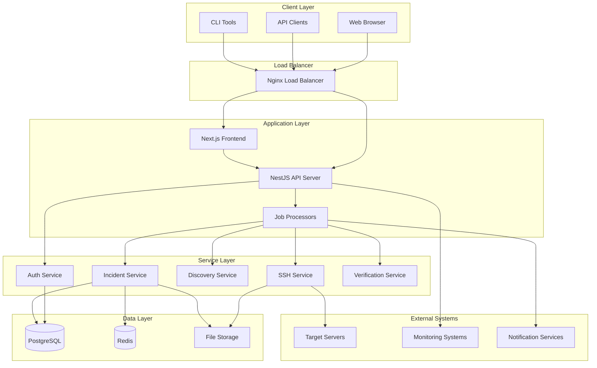
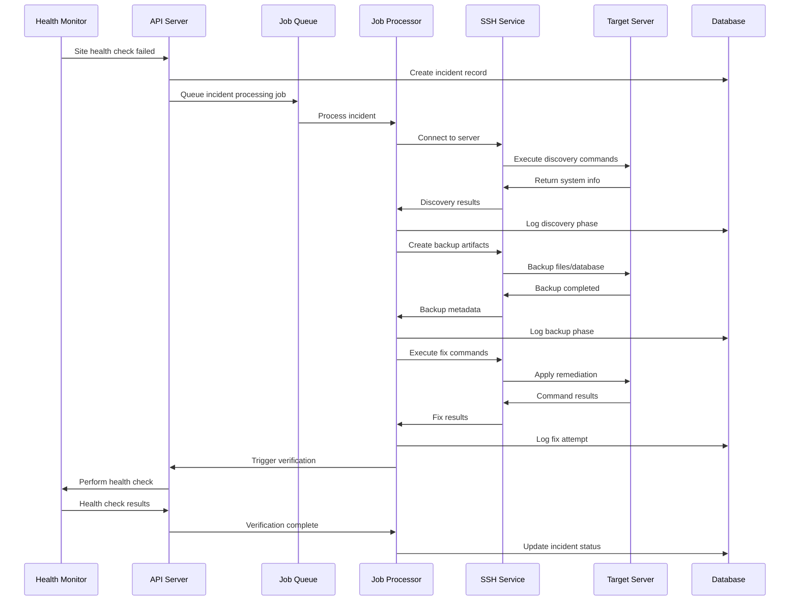
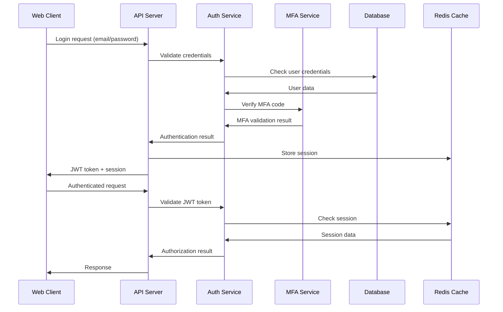

# WP-AutoHealer System Architecture

This document provides a comprehensive overview of the WP-AutoHealer system architecture, including component design, data flow, security model, and scalability considerations.

## 🏗️ High-Level Architecture

WP-AutoHealer follows a microservices architecture pattern with clear separation of concerns:



## 🧩 Component Architecture

### Frontend Layer (Next.js)

**Purpose:** User interface and user experience
**Technology:** Next.js 14 with App Router, TypeScript, Tailwind CSS

**Key Components:**
- **Dashboard:** System overview and metrics
- **Incident Management:** Real-time incident tracking
- **Site Management:** WordPress site configuration
- **Server Management:** SSH server connections
- **User Management:** RBAC and authentication
- **Settings:** System configuration

**Features:**
- Server-side rendering (SSR)
- Real-time updates via Server-Sent Events
- Responsive design for mobile/desktop
- Progressive Web App (PWA) capabilities
- Role-based UI rendering

### API Layer (NestJS)

**Purpose:** Business logic and data access
**Technology:** NestJS, TypeScript, Prisma ORM

**Core Modules:**

#### Authentication Module
```typescript
@Module({
  imports: [JwtModule, PassportModule],
  providers: [AuthService, JwtStrategy, MfaService],
  controllers: [AuthController],
  exports: [AuthService]
})
export class AuthModule {}
```

**Responsibilities:**
- User authentication and authorization
- JWT token management
- Multi-factor authentication (TOTP)
- Session management
- Role-based access control (RBAC)

#### Incident Module
```typescript
@Module({
  imports: [BullModule.registerQueue({ name: 'incident-processing' })],
  providers: [IncidentService, IncidentProcessor],
  controllers: [IncidentController],
  exports: [IncidentService]
})
export class IncidentModule {}
```

**Responsibilities:**
- Incident lifecycle management
- State machine implementation
- Timeline event tracking
- Fix attempt coordination
- Escalation handling

#### SSH Module
```typescript
@Module({
  providers: [SSHService, ConnectionPool, CommandExecutor],
  exports: [SSHService]
})
export class SSHModule {}
```

**Responsibilities:**
- Secure SSH connections
- Command execution with logging
- File transfer operations
- Connection pooling and management
- Host key verification

### Job Processing Layer (BullMQ)

**Purpose:** Asynchronous task processing
**Technology:** BullMQ, Redis, Node.js Worker Threads

**Job Types:**

#### Incident Processing Jobs
```typescript
@Processor('incident-processing')
export class IncidentProcessor {
  @Process('process-incident')
  async processIncident(job: Job<IncidentData>) {
    const stateMachine = new IncidentStateMachine(job.data);
    return await stateMachine.execute();
  }
}
```

**State Machine Flow:**
1. **NEW** → Initial incident creation
2. **DISCOVERY** → Environment detection and analysis
3. **BASELINE** → Current state capture
4. **BACKUP** → Create rollback artifacts
5. **OBSERVABILITY** → Collect diagnostic evidence
6. **FIX_ATTEMPT** → Apply remediation steps
7. **VERIFY** → Confirm resolution
8. **FIXED/ROLLBACK/ESCALATED** → Final states

#### Health Check Jobs
```typescript
@Processor('health-checks')
export class HealthCheckProcessor {
  @Process('site-health-check')
  async checkSiteHealth(job: Job<SiteHealthData>) {
    return await this.verificationService.performHealthCheck(job.data.site);
  }
}
```

### Data Layer

#### PostgreSQL Database

**Purpose:** Primary data storage with ACID compliance
**Schema Design:** Normalized relational model with audit trails

**Key Tables:**
- **users**: User accounts and authentication
- **servers**: SSH server configurations
- **sites**: WordPress site definitions
- **incidents**: Incident records and metadata
- **incident_events**: Append-only timeline events
- **command_executions**: SSH command logs
- **evidence**: Diagnostic data collection
- **backup_artifacts**: Rollback file metadata
- **audit_events**: System audit trail

**Performance Optimizations:**
- Indexed foreign keys and timestamps
- Partitioned large tables by date
- Connection pooling with Prisma
- Read replicas for reporting queries

#### Redis Cache & Queue

**Purpose:** Caching, session storage, and job queuing
**Usage Patterns:**

```typescript
// Session storage
const sessionKey = `session:${userId}:${sessionId}`;
await redis.setex(sessionKey, 86400, sessionData);

// Job queuing
const incidentQueue = new Queue('incident-processing', { connection: redis });
await incidentQueue.add('process-incident', { incidentId, siteId });

// Caching
const cacheKey = `site:health:${siteId}`;
await redis.setex(cacheKey, 300, healthCheckResult);
```

#### File Storage

**Purpose:** Backup artifacts and evidence files
**Structure:**
```
/data/wp-autohealer/
├── backups/
│   ├── {incident-id}/
│   │   ├── files/
│   │   ├── database/
│   │   └── metadata.json
├── evidence/
│   ├── {incident-id}/
│   │   ├── logs/
│   │   ├── screenshots/
│   │   └── diagnostics/
└── temp/
    └── {job-id}/
```

## 🔄 Data Flow Architecture

### Incident Processing Flow



### Authentication Flow



## 🔒 Security Architecture

### Defense in Depth Strategy

#### Network Security
- **TLS 1.3** encryption for all communications
- **Nginx reverse proxy** with security headers
- **Rate limiting** at multiple layers
- **IP whitelisting** for administrative access
- **VPN requirements** for production access

#### Application Security
- **JWT tokens** with short expiration times
- **RBAC** with principle of least privilege
- **Input validation** and sanitization
- **SQL injection** prevention via Prisma ORM
- **XSS protection** with CSP headers
- **CSRF protection** with SameSite cookies

#### Data Security
- **Encryption at rest** using libsodium
- **Secret redaction** in logs and APIs
- **Secure credential storage** with key derivation
- **Database encryption** for sensitive fields
- **Audit logging** for all operations

#### SSH Security
- **Strict host key checking** enabled
- **Key-based authentication** preferred
- **Connection timeouts** and limits
- **Command sanitization** and validation
- **Privilege escalation** prevention

### Security Implementation

```typescript
// Encryption service
@Injectable()
export class EncryptionService {
  private readonly key: Buffer;
  
  constructor() {
    this.key = sodium.crypto_secretbox_keygen();
  }
  
  encrypt(plaintext: string): string {
    const nonce = sodium.randombytes_buf(sodium.crypto_secretbox_NONCEBYTES);
    const ciphertext = sodium.crypto_secretbox_easy(plaintext, nonce, this.key);
    return sodium.to_base64(Buffer.concat([nonce, ciphertext]));
  }
  
  decrypt(encrypted: string): string {
    const data = sodium.from_base64(encrypted);
    const nonce = data.slice(0, sodium.crypto_secretbox_NONCEBYTES);
    const ciphertext = data.slice(sodium.crypto_secretbox_NONCEBYTES);
    return sodium.crypto_secretbox_open_easy(ciphertext, nonce, this.key, 'text');
  }
}

// SSH security
@Injectable()
export class SSHService {
  async connect(config: SSHConfig): Promise<SSHConnection> {
    const conn = new Client();
    
    return new Promise((resolve, reject) => {
      conn.connect({
        host: config.hostname,
        port: config.port,
        username: config.username,
        privateKey: config.privateKey,
        hostHash: 'sha256', // Enforce SHA-256 host keys
        hostVerifier: this.verifyHostKey.bind(this),
        algorithms: {
          kex: ['diffie-hellman-group14-sha256'], // Secure key exchange
          cipher: ['aes256-gcm'], // Authenticated encryption
          hmac: ['hmac-sha2-256'] // Strong MAC
        }
      });
    });
  }
  
  private verifyHostKey(hashedKey: string, callback: Function): void {
    // Implement strict host key verification
    const knownKey = this.getKnownHostKey(config.hostname);
    callback(hashedKey === knownKey);
  }
}
```

## 📈 Scalability Architecture

### Horizontal Scaling

#### API Server Scaling
```yaml
# Docker Compose scaling
services:
  api:
    image: wp-autohealer/api
    deploy:
      replicas: 3
      resources:
        limits:
          memory: 1G
          cpus: '0.5'
    environment:
      - NODE_ENV=production
      - DATABASE_POOL_SIZE=10
```

#### Job Processor Scaling
```typescript
// BullMQ concurrency configuration
const incidentQueue = new Queue('incident-processing', {
  connection: redis,
  defaultJobOptions: {
    removeOnComplete: 100,
    removeOnFail: 50,
    attempts: 3,
    backoff: {
      type: 'exponential',
      delay: 2000
    }
  }
});

// Multiple workers for parallel processing
for (let i = 0; i < CPU_COUNT; i++) {
  new Worker('incident-processing', processIncident, {
    connection: redis,
    concurrency: 5
  });
}
```

### Database Scaling

#### Read Replicas
```typescript
// Prisma read replica configuration
const prisma = new PrismaClient({
  datasources: {
    db: {
      url: process.env.DATABASE_URL // Primary
    }
  }
});

const prismaRead = new PrismaClient({
  datasources: {
    db: {
      url: process.env.DATABASE_READ_URL // Read replica
    }
  }
});

// Service layer with read/write separation
@Injectable()
export class IncidentService {
  async getIncidents(filters: IncidentFilters) {
    return prismaRead.incident.findMany({ where: filters }); // Read replica
  }
  
  async createIncident(data: CreateIncidentData) {
    return prisma.incident.create({ data }); // Primary database
  }
}
```

#### Database Partitioning
```sql
-- Partition incidents table by date
CREATE TABLE incidents_2024_01 PARTITION OF incidents
FOR VALUES FROM ('2024-01-01') TO ('2024-02-01');

CREATE TABLE incidents_2024_02 PARTITION OF incidents
FOR VALUES FROM ('2024-02-01') TO ('2024-03-01');

-- Automatic partition management
CREATE OR REPLACE FUNCTION create_monthly_partitions()
RETURNS void AS $$
DECLARE
    start_date date;
    end_date date;
    partition_name text;
BEGIN
    start_date := date_trunc('month', CURRENT_DATE + interval '1 month');
    end_date := start_date + interval '1 month';
    partition_name := 'incidents_' || to_char(start_date, 'YYYY_MM');
    
    EXECUTE format('CREATE TABLE %I PARTITION OF incidents FOR VALUES FROM (%L) TO (%L)',
                   partition_name, start_date, end_date);
END;
$$ LANGUAGE plpgsql;
```

### Caching Strategy

#### Multi-Level Caching
```typescript
@Injectable()
export class CacheService {
  // L1: In-memory cache (Node.js)
  private memoryCache = new Map<string, CacheEntry>();
  
  // L2: Redis cache (shared)
  constructor(private redis: Redis) {}
  
  async get<T>(key: string): Promise<T | null> {
    // Check L1 cache first
    const memoryEntry = this.memoryCache.get(key);
    if (memoryEntry && !this.isExpired(memoryEntry)) {
      return memoryEntry.value;
    }
    
    // Check L2 cache
    const redisValue = await this.redis.get(key);
    if (redisValue) {
      const value = JSON.parse(redisValue);
      this.memoryCache.set(key, { value, expiry: Date.now() + 60000 });
      return value;
    }
    
    return null;
  }
  
  async set<T>(key: string, value: T, ttl: number): Promise<void> {
    // Set in both caches
    this.memoryCache.set(key, { value, expiry: Date.now() + Math.min(ttl, 60000) });
    await this.redis.setex(key, ttl, JSON.stringify(value));
  }
}
```

## 🔄 Deployment Architecture

### Container Architecture

```dockerfile
# Multi-stage build for API
FROM node:18-alpine AS builder
WORKDIR /app
COPY package*.json ./
RUN npm ci --only=production

FROM node:18-alpine AS runtime
WORKDIR /app
COPY --from=builder /app/node_modules ./node_modules
COPY . .
RUN npm run build

EXPOSE 3001
CMD ["node", "dist/main.js"]
```

### Kubernetes Deployment

```yaml
apiVersion: apps/v1
kind: Deployment
metadata:
  name: wp-autohealer-api
spec:
  replicas: 3
  selector:
    matchLabels:
      app: wp-autohealer-api
  template:
    metadata:
      labels:
        app: wp-autohealer-api
    spec:
      containers:
      - name: api
        image: wp-autohealer/api:latest
        ports:
        - containerPort: 3001
        env:
        - name: DATABASE_URL
          valueFrom:
            secretKeyRef:
              name: wp-autohealer-secrets
              key: database-url
        resources:
          requests:
            memory: "512Mi"
            cpu: "250m"
          limits:
            memory: "1Gi"
            cpu: "500m"
        livenessProbe:
          httpGet:
            path: /health
            port: 3001
          initialDelaySeconds: 30
          periodSeconds: 10
        readinessProbe:
          httpGet:
            path: /health/ready
            port: 3001
          initialDelaySeconds: 5
          periodSeconds: 5
---
apiVersion: v1
kind: Service
metadata:
  name: wp-autohealer-api-service
spec:
  selector:
    app: wp-autohealer-api
  ports:
  - port: 80
    targetPort: 3001
  type: ClusterIP
```

## 📊 Monitoring Architecture

### Application Metrics

```typescript
// Prometheus metrics
import { register, Counter, Histogram, Gauge } from 'prom-client';

const incidentCounter = new Counter({
  name: 'wp_autohealer_incidents_total',
  help: 'Total number of incidents processed',
  labelNames: ['status', 'site_id']
});

const incidentDuration = new Histogram({
  name: 'wp_autohealer_incident_duration_seconds',
  help: 'Incident processing duration',
  buckets: [1, 5, 15, 30, 60, 300, 600]
});

const activeIncidents = new Gauge({
  name: 'wp_autohealer_active_incidents',
  help: 'Number of currently active incidents'
});

// Metrics middleware
@Injectable()
export class MetricsService {
  recordIncidentStart(incidentId: string, siteId: string): void {
    activeIncidents.inc();
    incidentCounter.inc({ status: 'started', site_id: siteId });
  }
  
  recordIncidentComplete(incidentId: string, siteId: string, duration: number, status: string): void {
    activeIncidents.dec();
    incidentCounter.inc({ status, site_id: siteId });
    incidentDuration.observe(duration / 1000);
  }
}
```

### Health Check Endpoints

```typescript
@Controller('health')
export class HealthController {
  @Get()
  async getHealth(): Promise<HealthStatus> {
    return {
      status: 'healthy',
      timestamp: new Date().toISOString(),
      version: process.env.APP_VERSION,
      uptime: process.uptime()
    };
  }
  
  @Get('ready')
  async getReadiness(): Promise<ReadinessStatus> {
    const [dbHealth, redisHealth, queueHealth] = await Promise.all([
      this.checkDatabase(),
      this.checkRedis(),
      this.checkJobQueue()
    ]);
    
    const ready = dbHealth && redisHealth && queueHealth;
    
    return {
      ready,
      checks: {
        database: dbHealth,
        redis: redisHealth,
        queue: queueHealth
      }
    };
  }
}
```

## 🔧 Configuration Management

### Environment-Based Configuration

```typescript
// Configuration schema validation
import Joi from 'joi';

const configSchema = Joi.object({
  NODE_ENV: Joi.string().valid('development', 'production', 'test').required(),
  PORT: Joi.number().default(3001),
  DATABASE_URL: Joi.string().uri().required(),
  REDIS_URL: Joi.string().uri().required(),
  JWT_SECRET: Joi.string().min(32).required(),
  ENCRYPTION_KEY: Joi.string().length(64).required(),
  SSH_TIMEOUT: Joi.number().default(30000),
  MAX_FIX_ATTEMPTS: Joi.number().min(1).max(20).default(15),
  RETENTION_DAYS: Joi.number().min(1).max(7).default(3)
});

@Injectable()
export class ConfigService {
  private readonly config: ConfigType;
  
  constructor() {
    const { error, value } = configSchema.validate(process.env);
    if (error) {
      throw new Error(`Configuration validation error: ${error.message}`);
    }
    this.config = value;
  }
  
  get<T extends keyof ConfigType>(key: T): ConfigType[T] {
    return this.config[key];
  }
}
```

This architecture provides a robust, scalable, and secure foundation for the WP-AutoHealer system, supporting both current requirements and future growth.

---

*Last updated: January 2024*